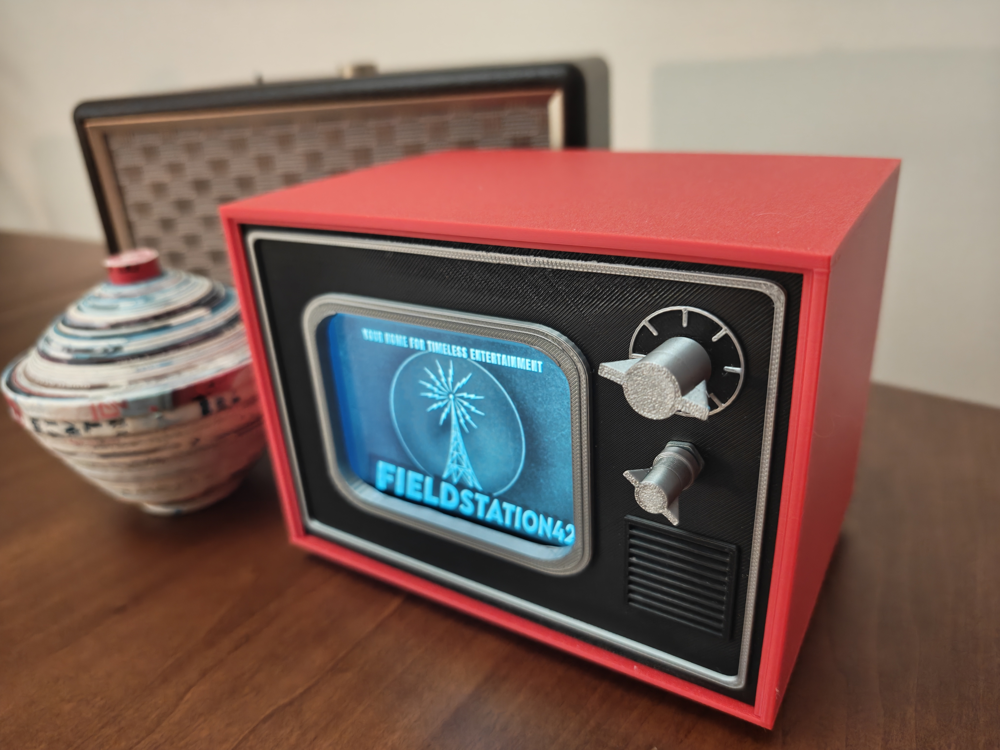

# Mini-TV Case for Rasberry Pi

Materials:
- [iPistBit 5 Inch DSI IPS LCD Display for Raspberry Pi 800x480](https://ipistbit.com/collections/10-1inch-touchscreen/products/ipistbit-5-inch-raspberry-pi-touchscreen-800x480-dsi-ips-lcd-display-5-point-touch-capacitive-screen-monitor-for-raspberry-pi-5-pi-4b-3b-3b-b-zero-400-driver-free)
- [360 Degree Rotary Encoder Code Switch Push Button EC11 Digital Potentiometer with Switch 5 Pin Handle](https://www.amazon.com/dp/B08728K3YB)
- Superglue

